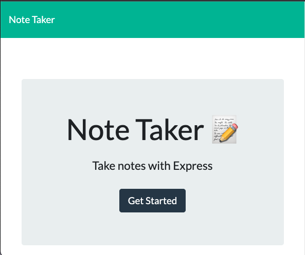
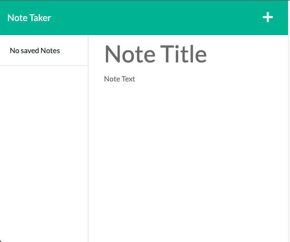
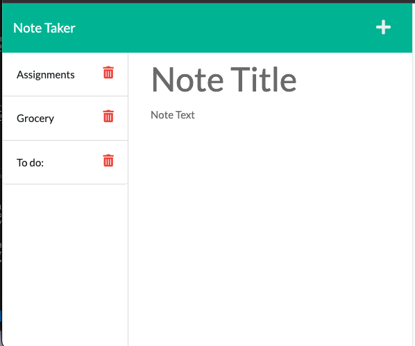

# Note Taker

## Description
This note taker lets us save notesof whatever you want to save. You can add the title and the content of it. You are able to delete the notes as well that you want to remove.

## User Story
```
As a user
I want to take notes.

When the user opens the homepage
I will be presented with a 'Get Started' button.

When the user clicks the 'Get Started Button'
I will be presented with a '+' at the top right to create a new note.

When the user created the new note
I can click the save button at the top left to save the note.

When the user wants to delete the note
I can click the delete icon next to the note heading.

```

## Getting Started

To use the note taker app, please open this link https://cryptic-sea-32619.herokuapp.com/ .

## App Look







## Reference

https://coding-boot-camp.github.io/full-stack/github/professional-readme-guide


Sam Ngu - 1-on-1 Tutor

Douglas Chan - TA

David Impey - Instructor

Scott Basquill - TA

## Licencse

©2022 Theresa Levina Gunawan.